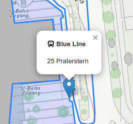
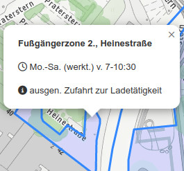

# Workload für die Woche vom 20. bis 27. April 2023

## 1. Popups nach den Vorgaben der Screenshots implementieren

  

verwendet Font Awesome für die Icons ...

## 2. Leaflet FullScreen Plugin implementieren

Bis spätestens **Donnerstag, den 27. April 2023 mittags** soll das fertige Beispiel unter https://usernmame.github.com/wien erreichbar sein
